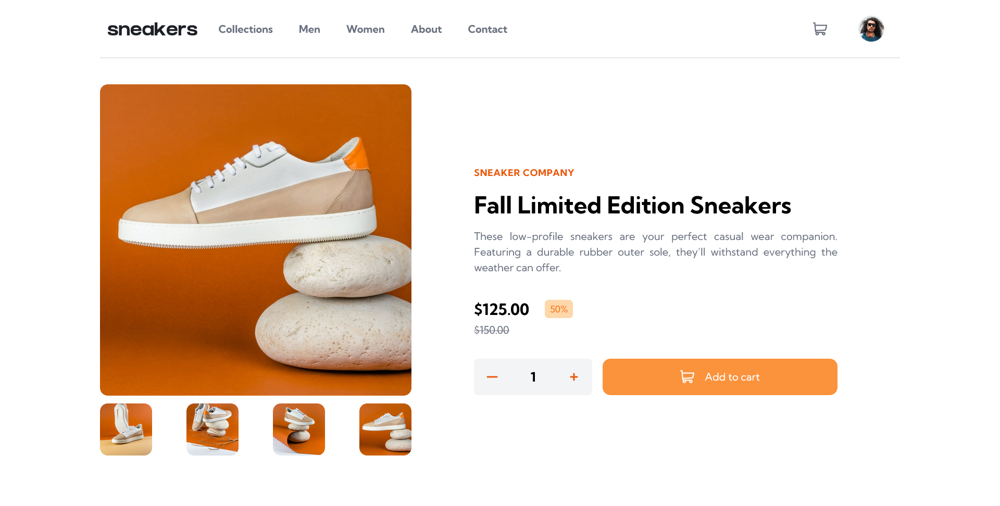

# Frontend Mentor - E-commerce product page solution

This is a solution to the [E-commerce product page challenge on Frontend Mentor](https://www.frontendmentor.io/challenges/ecommerce-product-page-UPsZ9MJp6). 
Frontend Mentor challenges help you improve your coding skills by building realistic projects.

## Table of contents

- [Overview](#overview)
  - [The challenge](#the-challenge)
  - [Screenshot](#screenshot)
  - [Links](#links)
- [My process](#my-process)
  - [Built with](#built-with)
  - [What I learned](#what-i-learned)
  - [Continued development](#continued-development)
  - [Useful resources](#useful-resources)
- [Author](#author)

**Note: Delete this note and update the table of contents based on what sections you keep.**

## Overview

### The challenge

Users should be able to:

- View the optimal layout for the site depending on their device's screen size
- See hover states for all interactive elements on the page
- Open a lightbox gallery by clicking on the large product image
- Switch the large product image by clicking on the small thumbnail images
- Add items to the cart
- View the cart and remove items from it

### Screenshot




### Links

- Solution URL: [github](https://github.com/Haybuka/ecommerce-product)
- Live Site URL: [netlify](https://prodcomm.netlify.app)

## My process

### Built with

- Semantic HTML5 markup
- CSS custom properties
- Flexbox
- CSS Grid
- Mobile-first workflow
- Tailwindcss
- lightbox
- [React](https://reactjs.org/) - JS library
- [Lightbox](https://reactjsexample.com/a-minimal-lightbox-package-for-react/) - React framework
- [Tailwind css](tailwindcss.com/) - For styles


### What I learned

During the course of this project, i got more reinforcement on the use of tailwindCss in projects and some quick hacks. Important to note is also passing functions about, and the use of memo to limit renders based on user calculations.
in addition, i also got more practice with creating and consuming a context, and i gave usereducer a try, although i had to strip it off because it didnt feel like it belonged.


```js
updating quantity state based on action,surrogate reducer?
switch (action) {
       case  "add":
         setQuantity(quantity + 1)
         break;
       case "minus":
          setQuantity(quantity - 1)
          break;
       default:
         break;
     }

context setup

export const productContext = createContext()
export function ProductProvider({children}) {
    let [cartItem,setCartItem] = useState([])
     let [toggleNav,setToggleNav] = useState(false)
    
    let products = [
        {}
      ]

      function updateCart(cartUpdate,id){
        setCartItem([ cartUpdate])
      }
      function deleteItem(id){
        let updatedCart = cartItem.filter(item => item.id !== id );
        setCartItem(updatedCart)
      }
  return (
    <productContext.Provider value={{products,updateCart,deleteItem,cartItem,toggleNav,setToggleNav}}>
        {children}
    </productContext.Provider>
  )
}
```


### Continued development

For my continued developement, i do hope to have down the basics of useReducer, now that i have a clear understanding of context and the plain js reducer.


### Useful resources

- [React Lightbox](https://reactjsexample.com/a-minimal-lightbox-package-for-react/) - React lightbox is a tool that does as its name suggests, its used to create details on images
- [Hero Icon](https://heroicons.dev/) - This is an amazing article which helped me finally understand XYZ. I'd recommend it to anyone still learning this concept.


## Author

- Website - [Paschal](chukwu.netlify.app/)
- Frontend Mentor - [@haybukarh](https://www.frontendmentor.io/profile/Haybuka)
- Twitter - [@haybukarh](https://twitter.com/haybukarh


